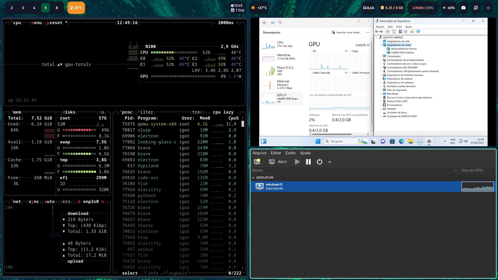

<p align="right">
  <a href="README.md">
     English
  </a>
</p>

# Resultados

##
<p align="center">
  <a href= "Images/image.png">
  
</p>

##
# Ativação de SR-IOV para GPU da Radxa X4 e Looking Glass

Este projeto detalha o processo de ativação do **SR-IOV (Single-Root I/O Virtualization)** na **iGPU (GPU integrada)** da placa **Radxa X4**. O objetivo é criar uma **VF (Virtual Function)** para fazer o **passthrough** dessa GPU para uma máquina virtual (VM) **Windows**. A VM é então utilizada para executar jogos e aplicativos gráficos, e a saída de vídeo é capturada e exibida na máquina host Linux usando a ferramenta **Looking Glass**.

## Por que este projeto?

A ativação do SR-IOV em GPUs integradas é um desafio técnico, e a documentação para a Radxa X4 é escassa. Este projeto serve como um guia detalhado, passo a passo, para permitir que outros usuários com a mesma configuração possam replicar o processo e aproveitar o desempenho gráfico da iGPU em uma VM sem a necessidade de uma segunda placa de vídeo dedicada.
E alem do mais o uso de uma GPU em VMs ajuda a diminuir a carga imposta no processador, tornado o uso mais pratico desse Hardware para aplicações de VDI.

## Componentes Principais

  * **Radxa X4:** Placa-mãe utilizada como host.
  * **SR-IOV:** Recurso de virtualização que permite que um único dispositivo PCIe (a GPU) seja compartilhado entre várias VMs como se fossem dispositivos separados.
  * **VM Windows:** A máquina virtual onde a VF da GPU será utilizada.
  * **GPU Passthrough:** O processo de dar acesso direto e exclusivo de uma VF da GPU para a VM.
  * **Looking Glass:** Uma ferramenta de baixo atraso que captura o framebuffer da VM e o exibe no host, permitindo que a VM seja usada como se fosse um aplicativo nativo no desktop Linux.

## Pré-requisitos

Para seguir este guia, você precisará dos seguintes itens:

  * Placa **Radxa X4** (com BIOS atualizada que suporte SR-IOV).
  * Um sistema operacional **Linux** (distribuição recomendada: Arch Linux ou Ubuntu Server, Nesse projeto foi testado na distribuiçao chamanda Cachy Os que é baseada em Arch).
  * Ferramentas de virtualização como **QEMU/KVM** e **libvirt**.
  * Conhecimento básico de linha de comando Linux.
  * A ferramenta **Looking Glass** (compilada a partir do código-fonte ou instalada via repositório).

## Guia de Instalação e Configuração

### 1\. Configuração da BIOS

A primeira etapa é garantir que o SR-IOV está ativado na BIOS da sua Radxa X4.
Reinicie a placa e entre na BIOS. Procure pelas seguintes opções e ative-as:

  * **Intel VT-d**

Salve as configurações e reinicie.

Além disso, para o passthrough funcionar corretamente, é necessário o IntelGopDriver.efi, um arquivo de driver que não está disponível para download. A única maneira de obtê-lo é extraindo-o diretamente da sua BIOS. Use uma ferramenta como o UEFItool para extrair o driver e colocá-lo em um local acessível para a sua VM.

### 2\. Configuração do Host Linux

1.  **Habilitar o SR-IOV no Kernel:**
    Edite o arquivo `/etc/default/grub` Na linha `GRUB_CMDLINE_LINUX_DEFAULT`.

    ```bash
    GRUB_CMDLINE_LINUX_DEFAULT='intel_iommu=on i915.enable_guc=3 i915.max_vfs=7 i915.enable_fbc=0 apparmor=1 security=apparmor'
    ```

Essa string é uma linha de comando do kernel Linux usada para configurar o comportamento do sistema durante a inicialização.

### Explicação dos Parâmetros

---

- **`intel_iommu=on`**: Ativa o **IOMMU (Input/Output Memory Management Unit)** para processadores Intel. O IOMMU é essencial para a virtualização de dispositivos (como o **PCI Passthrough**), pois permite que máquinas virtuais acessem diretamente o hardware físico, como uma GPU. Sem ele, a VM não consegue isolar o dispositivo para seu uso exclusivo.

---

- **`i915.enable_guc=3`**: Habilita o uso do firmware **GuC (Graphics micro-controller)** para a GPU Intel i915. O valor `3` significa que o GuC será usado tanto para o agendamento de tarefas (`scheduling`) quanto para o carregamento do firmware (`loading`). Isso é crucial para que a GPU possa gerenciar suas próprias cargas de trabalho de forma eficiente, um requisito para recursos como o **SR-IOV**.

---

- **`i915.max_vfs=7`**: Define o número máximo de **VFs (Virtual Functions)** que a GPU Intel i915 pode criar. No seu caso, a placa de vídeo será dividida em 7 funções virtuais, permitindo que cada uma seja atribuída a uma máquina virtual diferente. Isso é a base do **SR-IOV**, pois o hardware é virtualizado em múltiplas instâncias.

---

- **`i915.enable_fbc=0`**: Desativa o **Frame Buffer Compression (FBC)** da GPU. Em alguns casos, o FBC pode causar problemas de compatibilidade ou instabilidade quando o **PCI Passthrough** está ativo, por isso desativá-lo garante um comportamento mais previsível da GPU ao ser usada por uma VM.

---

- **`apparmor=1 security=apparmor`**: Habilita o módulo de segurança **AppArmor** no kernel. Ele é usado para impor políticas de controle de acesso para programas, limitando o que eles podem fazer e garantindo a segurança do sistema host. Embora não esteja diretamente relacionado à virtualização, é uma prática de segurança recomendada.

    Atualize o GRUB:

    ```bash
    sudo update-grub
    ```

2.  **Verificar o IOMMU e as VFs:**
    Após reiniciar, verifique se o IOMMU está ativo e se a GPU foi particionada corretamente em Virtual Functions (VFs).

    ```bash
    dmesg | grep -i iommu
    lspci -nnk
    ```

    Você deverá ver a sua GPU listada com a `iommu group` e as VFs criadas.

3.  **Configurar a VM no `libvirt`:**
   A seção `hostdev` no XML é a parte mais crítica para o seu projeto, pois ela configura o **passthrough** da **Virtual Function (VF)** da GPU para a VM.

**O que precisa ser explicado:**

  * **Dispositivo `hostdev`**: Descreva que você está adicionando um dispositivo do tipo `hostdev` para fazer o **passthrough** de um dispositivo PCI do host para a VM.
  * **Endereço do dispositivo**: O endereço do dispositivo (`address domain="0x0000" bus="0x00" slot="0x02" function="0x2"`) deve ser mencionado. Explique que este é o endereço específico da **Virtual Function** da iGPU, obtido a partir do comando `lspci`.
  * **Driver `vfio`**: Mencione que o driver `vfio` está sendo usado para o **passthrough**. O VFIO (Virtual Function I/O) é um framework que permite a uma VM ter acesso seguro a dispositivos PCI do host.
  * **ROM da BIOS da GPU (`IntelGopDriver.efi`)**: É fundamental destacar que a `rom` da BIOS da GPU é injetada na VM com a linha `rom bar="on" file="/home/${user}/Downloads/IntelGopDriver.efi"`. Explique que esse arquivo é necessário para que a VM inicialize com a GPU, já que a BIOS da placa-mãe Radxa não é capaz de inicializar o dispositivo para a VM sozinha.

### 2\. Configuração do Looking Glass

A seção `qemu:commandline` do XML é onde a comunicação entre o host e a VM para o Looking Glass é configurada.

**O que precisa ser explicado:**

  * **Comunicação com o Looking Glass**: Descreva que os argumentos `-device` e `-object` na linha de comando do QEMU são usados para configurar o **`ivshmem` (Inter-VM Shared Memory)**.
  * **`ivshmem-plain,memdev=ivshmem`**: Explique que isso cria um dispositivo de memória compartilhada.
  * **`memory-backend-file,id=ivshmem,share=on,mem-path=/dev/kvmfr0,size=128M`**: Mencione que essa é a configuração de backend da memória, que cria um arquivo de memória compartilhada em `/dev/kvmfr0`. É por meio desse arquivo que a VM e o host se comunicam para o Looking Glass, permitindo a transmissão do vídeo com baixa latência.

### 3\. Remoção do Dispositivo de Vídeo Virtual

Por fim, é importante notar a linha `<video><model type="none"/></video>`.

**O que precisa ser explicado:**

  * **Desativar o Vídeo Virtual**: Explique que essa linha é crucial, pois desativa a placa de vídeo virtual padrão do QEMU. Isso garante que a VM utilize exclusivamente a GPU que você está passando através do **passthrough**, evitando conflitos.

### Sugestão de Seções para o `README.md`

Para organizar as informações, você pode adicionar uma nova seção ao seu `README.md` com os detalhes do XML.

````markdown
---
## Detalhes da Configuração da VM (`.xml`)

Este projeto utiliza um arquivo de configuração `.xml` para a máquina virtual, que contém as configurações específicas necessárias para o passthrough da GPU e a integração com o Looking Glass. As seções mais importantes são:

### GPU Passthrough e Injeção da BIOS

A seção `<devices>` é onde o passthrough da GPU é definido. O driver `vfio` é usado para isolar a **Virtual Function (VF)** da GPU do host, e o endereço da VF é especificado.

```xml
<hostdev mode="subsystem" type="pci" managed="yes">
  <driver name="vfio"/>
  <source>
    <address domain="0x0000" bus="0x00" slot="0x02" function="0x2"/>
  </source>
  <rom bar="on" file="/home/${user}/Downloads/IntelGopDriver.efi"/>
  <address type="pci" domain="0x0000" bus="0x06" slot="0x00" function="0x0"/>
</hostdev>
````

É crucial notar a linha `<rom>`, que injeta o arquivo `IntelGopDriver.efi` na VM. Este arquivo é extraído da sua BIOS e é essencial para que o passthrough da GPU funcione corretamente.

### Configuração do Looking Glass

Para a comunicação entre a VM e o host, o `ivshmem` é configurado através da linha de comando do QEMU.

```xml
<qemu:commandline>
  <qemu:arg value="-device"/>
  <qemu:arg value="ivshmem-plain,memdev=ivshmem"/>
  <qemu:arg value="-object"/>
  <qemu:arg value="memory-backend-file,id=ivshmem,share=on,mem-path=/dev/kvmfr0,size=128M"/>
</qemu:commandline>
```

Esta configuração cria um espaço de memória compartilhada (`/dev/kvmfr0`) que o cliente do Looking Glass no host usa para ler o framebuffer da VM com baixa latência.

### Desativando o Vídeo Virtual

Para garantir que a VM use a GPU real e não a virtual, a placa de vídeo virtual é desativada.

```xml
<video>
  <model type="none"/>
</video>
```

```
```

### 3\. Configuração do Looking Glass

1.  **Na VM Windows:**
    Instale os drivers da GPU e o cliente Looking Glass (`looking-glass-client.exe`).
    Certifique-se de que a VM esteja configurada para ter o Looking Glass ativo na inicialização.

2.  **No Host Linux:**
    Execute o `looking-glass-client` para se conectar à VM.

    ```bash
    looking-glass-client -f 
    ```

    O cliente irá se conectar à VM e exibir a tela dela em uma janela no seu desktop Linux, permitindo que você interaja com a VM como se fosse um aplicativo nativo.

## Contribuição

Contribuições são sempre bem-vindas\! Se você encontrar um erro ou tiver uma melhoria a sugerir, sinta-se à vontade para abrir uma *issue* ou enviar um *pull request*.

-----